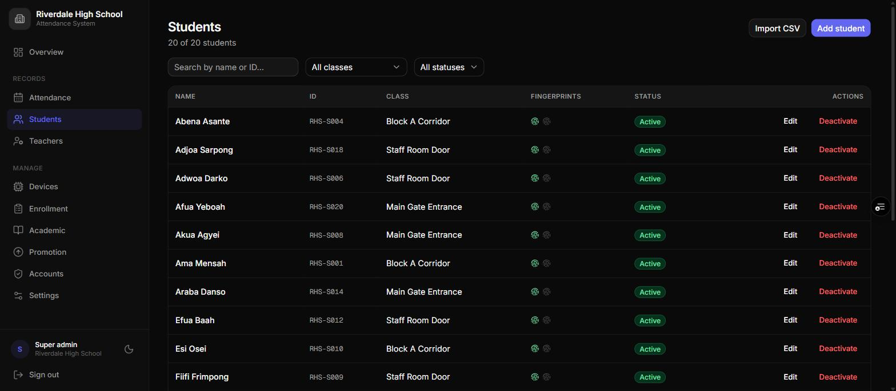
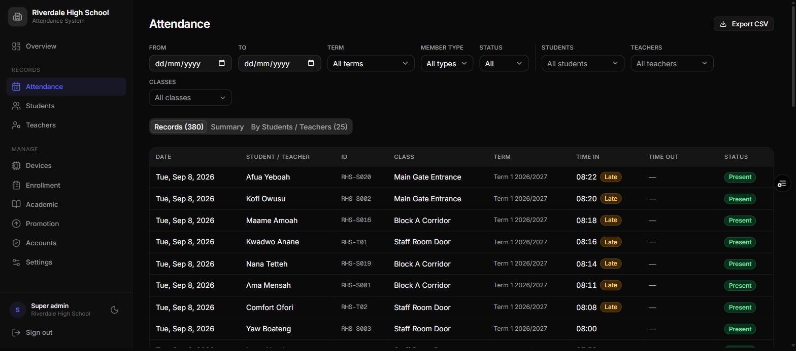

# Administrator Manual
:kicker: Role guide
:subtitle: Running the day-to-day: people, periods, holidays, attendance, and year-end
:audience: Administrators within an institution
:version: Version 3.0 | September 2026
:accent: #1d4ed8
:series: admin
:output: clients

<<<TOC>>>

## 1. At a glance

>> As an admin you keep the records right from day to day: you add and update people, set up periods and holidays, check and export attendance, and run the year-end promotion in a school. Device set-up, settings, and accounts belong to your super admin.

::: can
- Add, edit, import, and deactivate members and staff
- Manage periods and holidays (or closed days)
- View, filter, and export attendance
- Run year-end promotion (schools)
- In a shop: clients, sales, catalog, loyalty, reports
- See the account list and change your own password
:::
::: cannot
- Set up, rename, or delete scanners
- Change institution settings or labels
- Create, edit, or delete accounts
- Change anyone else's password
- Enrol fingerprints -- unless your account is tied to one unit (section 5)
:::

> [!TIP] This guide covers what your **role** can do. Read it alongside the guide for your kind of organisation -- the School, Office, or Shop manual -- which explains how the system fits your day.

### 1.1 Two kinds of admin account

Your super admin chose one of these when creating your account:

<!-- cols: 30 70 -->
| Account | What you see and manage |
| --- | --- |
| **Whole institution** | Every unit's people and records. This is the usual kind. |
| **Tied to one unit** | Only that unit's people and records -- and you can enrol fingerprints on its scanner. A padlock chip on the Attendance page shows which unit. |

### 1.2 Words used in this guide

Your institution may have renamed these under Settings, so your screens might say *Student*, *Form*, *Class*, or *Term* instead.

<!-- cols: 20 50 30 -->
| Word | Meaning | A school might say |
| --- | --- | --- |
| **Member** | A person whose attendance is recorded | Student |
| **Staff** | People on the second roster, if your institution keeps one | Teacher |
| **Group** | A set of units | Form, Grade, or Year |
| **Unit** | One place people scan -- each has its own scanner | Class |
| **Period** | A stretch of time you report on | Term |
| **Active** | Included in attendance and absence marking | -- |

## 2. Signing in and finding your way

1. Open the dashboard address your super admin gave you.
2. Enter your email and password, then press **Sign in**.

The first page is **Overview**: today's present and absent counts, the attendance rate, and the most recent scans. The menu on the left groups everything else under **Records**, **Shop** (shops only), and **Manage**, and shows only pages your role can open.

On a phone, the menu is a bar along the bottom -- **Overview**, **Attendance**, your roster, and **More**. Press **Install app** in the menu to add the dashboard to your home screen; on an iPhone use Safari's Share icon, then **Add to Home Screen**.

> [!NOTE] The dashboard signs you out after **10 minutes** without activity, and when you close the browser. Pages refresh by themselves as new scans arrive.

## 3. Members and staff

Go to **Members** (or **Staff** for the second roster -- both work the same way).

### 3.1 Adding one person

1. Press **Add member**.
2. Enter their **Full name** and **ID** -- the school or staff number you already use.
3. Choose their **Unit**. The list shows each scanner as group and unit, e.g. *Form 2 Science*.
4. Press **Add member**.

The next screen offers to enrol fingerprints straight away. If your account is tied to their unit you can do it there (section 5); otherwise press **Done** and ask your super admin to enrol them.

### 3.2 Importing a spreadsheet

1. Press **Import CSV**, then download the template.
2. Fill in one row per person with the columns `sid` (ID), `fullname`, and the unit.
3. Write the unit the way the dashboard shows it, e.g. *Form 2 Science*. The unit name alone also works when it's unique.
4. Upload the file. A preview marks each row as ready or explains the problem -- a missing field, or a unit it can't find -- before anything is saved.
5. Confirm.

> [!NOTE] **Imported people start Inactive**, because they have no fingerprints yet. Activate each person once they're enrolled -- only active people are counted in attendance and absence marking.

### 3.3 Editing someone

Press the edit icon on their row to change the name, ID, or unit. The **Fingerprints** panel shows which sensor slots hold their fingers.

### 3.4 Leavers

Press **Deactivate** on their row. They stop being marked absent from that day, and their full history stays available in reports and exports. Press **Activate** to bring them back.

There is no delete button for people -- deactivating keeps the history, which you'll want for reports.

## 4. Periods and holidays

The page is called **Academic** in a school, **Periods & Holidays** in an office, and **Closed Days** in a shop (holidays only).

### 4.1 Periods

1. Press **Add term** (the button uses your institution's word for a period).
2. Enter the **Term** name, the **Year** -- e.g. *2026* or *2025/2026* -- and the start and end dates.
3. Save, then press **Set active** on its row.

Keep exactly one period active. Each scan is filed under whichever period was active at the time, and reports default to it.

### 4.2 Holidays

1. Open the **Holidays** tab and press **Add holiday**.
2. Enter a **Label** and a **Start date**. Add an **End date** for a break of several days.
3. Tick **Repeats every year** for fixed dates such as Independence Day. Leave it unticked for dates that move, such as Easter.
4. Save.

Nobody is marked absent on a holiday. Weekends don't need adding -- your super admin sets which weekdays count under **Days tracked** in Settings.

> [!TIP] Add the whole period's holidays when you create the period. A missed holiday produces a full roster of false absences that someone then has to explain.

## 5. Enrolling fingerprints (unit-tied admins)

If your account is tied to one unit, **Enrollment** appears in your menu and you can register or delete fingerprints on that unit's scanner. Otherwise your super admin does this.

1. Press **New job**.
2. Choose **Register**, the person, and **Finger 1** or **Finger 2**. The sensor slot is filled in for you.
3. Queue the job, then have the person at the scanner.
4. They press the finger when the screen says "PRESS 1/2", lift it at "REMOVE", and press the same finger again at "PRESS 2/2".
5. "ENROLLED" on the screen and **Completed** on the dashboard mean it worked.

You can also do this from the person's edit screen: the **Fingerprints** panel has an enrol button for an empty finger and **Delete** for a stored one. The Super Administrator Manual covers failed and stuck jobs in detail.

## 6. Attendance

Go to **Attendance**.

<!-- cols: 22 78 -->
| Tab | What it shows |
| --- | --- |
| **Records** | One row per person per day: date, name, ID, unit, period, time or time in / time out, and status. |
| **Summary** | Present and absent totals, and the attendance percentage, per unit and period. |
| **By member** | Each person's days present and absent, their rate, and when they were last seen. |

Narrow the list with **From** / **To**, **Period**, **Member type**, **Status**, and the people and unit pickers. If your institution flags punctuality, late arrivals carry a **Late** badge and early departures an **Early** badge.

To export, set your filters and press **Export CSV**. The file opens in Excel or Google Sheets and contains exactly what the filters show.

> [!NOTE] Nobody marks absences by hand. Each evening the system adds an **Absent** record for every active person who didn't scan, skipping holidays and untracked weekdays. Scans saved by an offline scanner upload later and correct those records.

## 7. Year-end promotion (schools)

**Promotion** moves every active student up one group -- *Form 1* to *Form 2*, and so on. Students in the final group are deactivated instead.

1. Go to **Promotion** and read the preview: each card shows how many students move from one group to the next.
2. Check the warning list. A student is skipped if there's no scanner for their next group with the same unit name -- ask your super admin to set it up first.
3. Press **Apply promotion**, read the summary, and press **Confirm**.

> [!WARNING] Promotion can't be undone. **Export the year's attendance first.** Promoted students' fingerprint links are cleared, so each one must be **enrolled again** on their new class's scanner before they can scan.

The School Manual explains how the dashboard works out the order of groups.

## 8. Shop duties

In a shop your menu also has **Clients**, **Sales**, **Catalog**, **Loyalty**, and **Reports**. The Shop Manual covers them in full:

- **Clients** -- your customers, keyed by a unique phone number, with visit history and loyalty progress
- **Sales** -- record what was sold, to whom, and by which staff member
- **Catalog** -- products and services, with prices and product stock
- **Loyalty** -- reward rules, and issuing rewards to clients who have earned them
- **Reports** -- takings, top clients, revenue per staff member, best sellers, visits, low stock, and rewards

## 9. Accounts

**Accounts** lists everyone who can sign in to your institution's dashboard. Search by email or filter by role.

To change **your own** password, press the key icon on your row and enter a new one of at least 8 characters. Everything else on this page -- new accounts, role changes, other people's passwords -- is done by your super admin.

## 10. The scanner, at a glance

::: screens
PRESENT | Ama Mensah | **Recorded.** May say "TIME IN" or "TIME OUT".
SAVED | Ama Mensah | Offline | **Saved offline**; uploads when the internet returns.
NOT LOGGED | Ama Mensah | **Not counted** -- holiday, untracked day, or duplicate.
NO MATCH | **Not recognised.** Try again, finger flat.
NOT MAPPED | See admin | **No person linked** to that finger on this scanner.
08:14 | Form 2 Science | Offline | 3 queued | **No internet.** 3 scans waiting to upload.
:::

| Light | Meaning |
| --- | --- |
| Solid blue | Ready and online |
| Solid purple | Ready, but no WiFi |
| Green flash | Scan accepted |
| Red flash | Not recognised |
| Solid yellow | Waiting for a finger during enrollment |
| Breathing yellow | Waiting to be set up |
| Breathing red | Installing an update -- do not unplug |

## 11. Getting help

<!-- cols: 50 50 -->
| Problem | Who to ask |
| --- | --- |
| Someone needs fingerprints enrolled | Your super admin (or you, if tied to their unit) |
| A scanner isn't working or shows an odd screen | Your super admin |
| A new account, a role change, or someone else's password | Your super admin |
| A setting or label needs changing | Your super admin |
| A whole day shows everyone absent | Check holidays first, then ask your super admin to check the scanner |
