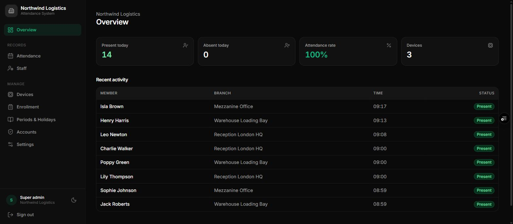
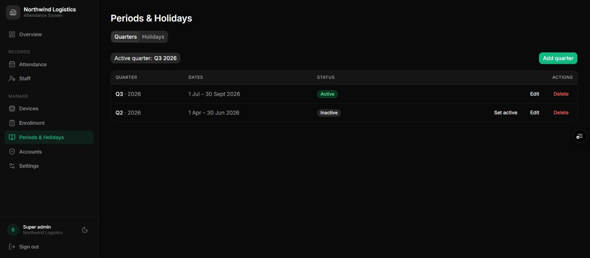
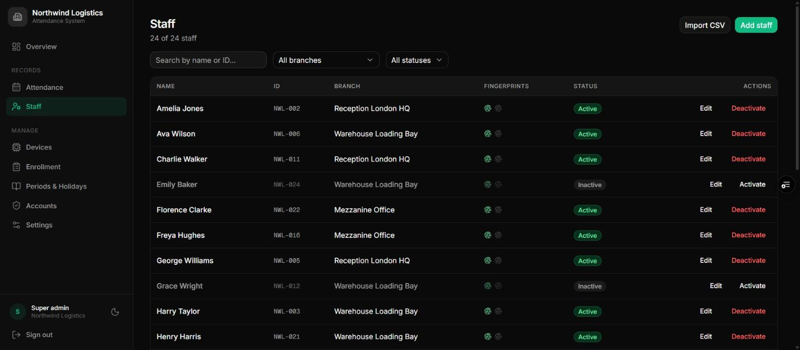
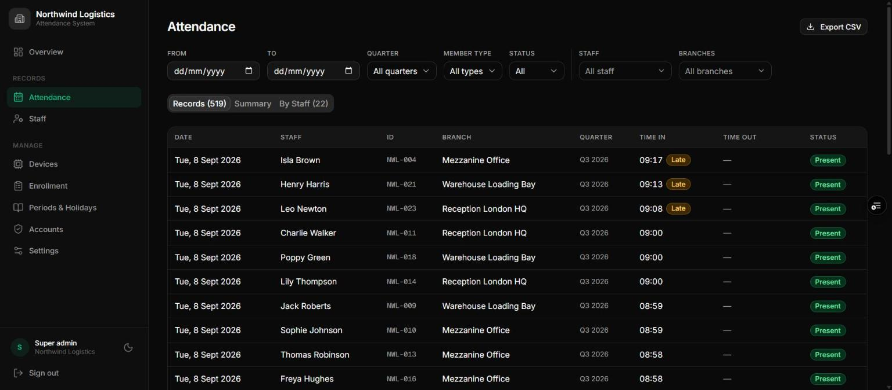

# Office Manual
:kicker: Institution type guide
:subtitle: Running a company, clinic, church, or any organisation on the attendance system
:audience: Office administrators, HR staff, and supervisors
:version: Version 3.0 | September 2026
:accent: #15803d
:series: office
:output: clients

<<<TOC>>>

## 1. What an office account looks like

>> An office account records the people who work for you by fingerprint. It's the general-purpose type -- for a company, clinic, NGO, church, factory, or any organisation that needs a reliable record of who was in, and when.

Your menu has:

- **Overview** -- present and absent today, the attendance rate, and the latest scans
- **Attendance** -- every record, with filters, totals, and export
- **Staff** and / or **Members** -- your people
- **Devices** and **Enrollment** -- the scanners and the fingerprints on them
- **Periods & Holidays** -- reporting periods and non-working days
- **Accounts** and **Settings**

There are no academic terms and no year-end promotion -- those are school-only.

### 1.1 Two ways to record a day

Set under **Settings -> Scan mode**. It's the most important choice you'll make.

<!-- cols: 24 44 32 -->
| Mode | How it works | Choose it when |
| --- | --- | --- |
| **Present / Absent** | One scan marks the person present for the day. | You only need to know who came in. |
| **Time In / Time Out** | The first scan is arrival, the second is departure. Both appear on one row. | You need hours, lateness, or early departures. |

You can set a different mode for each roster -- members and staff.

> [!TIP] Start with **Present / Absent** unless you have a concrete reason to track hours. It's quicker at the door, and you can switch later.

## 2. Setting up, in the right order

1. **Settings** -- name, logo, timezone, scan mode, and **Days tracked** (leave Saturday and Sunday unselected if you're a Monday-to-Friday operation).
2. **Periods & Holidays** -- create your current reporting period, press **Set active**, and add public holidays.
3. **Devices** -- give each scanner its department and location, e.g. *Operations* and *Warehouse*.
4. **Staff** -- add your people, or import them from a spreadsheet.
5. **Enrollment** -- enrol each person's fingerprints, then activate them.
6. **Accounts** -- create logins for HR, department heads, and supervisors.

> [!WARNING] Choose your scan mode **before** you enrol anyone. Switching mid-period leaves two different shapes of record in the same report.

## 3. Words you can change

The defaults are Member, Group, Unit, and Period. Rename them under **Settings -> Custom labels**:

<!-- cols: 34 66 -->
| Default | An office usually says |
| --- | --- |
| Member / Members | Employee / Employees |
| Group | Department or Division |
| Unit | Team, Branch, or Site |
| Period | Quarter, Month, or Year |

The new words appear everywhere, including CSV headings. Nothing about the data changes.

### 3.1 One roster or two

Two rosters are available, each switched on under **Settings**:

- Most offices use **one** roster for everybody -- turn on **Track staff** only. The Members page then disappears.
- Use both for two genuinely different groups -- say, a clinic's employees on one roster and volunteers on the other, each with its own scan mode.

## 4. Periods and holidays

### 4.1 Periods

A period is simply a reporting bucket -- a quarter, a month, or a year, whatever matches how you report. Press **Add** on the first tab, enter a name, year, and dates, save, then press **Set active** on its row. Keep exactly one active; each scan is filed under it.

### 4.2 Holidays

On the **Holidays** tab, add every non-working day: public holidays, company shutdowns, stocktaking days. Nobody is marked absent on them. Tick **Repeats every year** for fixed dates; leave it unticked for dates that move.

**Days tracked** in Settings handles weekends for you -- leave the days you're closed unselected instead of adding them as holidays.

## 5. Your people

### 5.1 Adding one person

Go to **Staff** and press **Add**. Enter the full name and ID, and choose their unit -- listed as department and location. The dashboard then offers to enrol their fingerprints straight away.

### 5.2 Importing a spreadsheet

1. Press **Import CSV** and download the template.
2. Fill in one row per person: `sid` (staff number), `fullname`, and the unit as the dashboard shows it.
3. Upload and review the preview, which flags any row it can't use before anything is saved.
4. Confirm.

**Imported people start Inactive** because they have no fingerprints yet. Enrol each one, then press **Activate**.

### 5.3 Leavers

Press **Deactivate** on their row on their last day. Their history is kept and they stop being marked absent. People are never deleted.

> [!NOTE] If you forget to deactivate a leaver, they collect an absence every working day, which distorts your reports until someone notices.

## 6. Lateness and early departures

Under **Settings**, two optional switches turn the attendance record into a punctuality record:

<!-- cols: 30 70 -->
| Setting | What it does |
| --- | --- |
| **Flag late arrivals** | Set an **Expected start time** and a **Grace period** in minutes. Anyone whose first scan is after start plus grace gets a **Late** badge. |
| **Flag early departures** | Set an **Expected end time** and a **Grace period**. A time-out scan before end minus grace gets an **Early** badge. Only works in Time In / Time Out mode. |

For example, with a start of 08:00 and 10 minutes' grace, a scan at 08:09 is on time and 08:11 is late.

## 7. Accounts for supervisors

Give department heads and shift supervisors a **Staff** account assigned to their unit. They can see and export their own team's attendance and nothing else, and can't change anything.

For a supervisor who should also manage their team's records -- adding people, enrolling fingerprints on their scanner -- create an **Admin** account assigned to that unit instead. Leave the unit blank for an HR admin who covers everyone.

## 8. Getting data out

Go to **Attendance**, set the filters -- dates, period, member type, status, people, units -- and press **Export CSV**. The file opens in Excel or Google Sheets.

This is how attendance feeds payroll: filter to the pay period and the department, export, and hand the file over. In Time In / Time Out mode both times are on the same row, so hours are a simple subtraction in the spreadsheet.

**Summary** gives each unit's present and absent totals and attendance percentage per period; **By member** gives each person's totals and last scan.

## 9. Everyday problems

<!-- cols: 38 62 -->
| Problem | What to do |
| --- | --- |
| Everyone is absent on a working day | A holiday was entered by mistake, or the scanner was off all day. Check both. |
| Everyone is absent on a weekend | Saturday or Sunday is still selected under **Days tracked**. Unselect it. |
| Someone was at work but shows absent | They didn't scan, or the scan failed -- "NO MATCH" on the screen means it didn't count. |
| A time out but no time in | Their first scan of the day didn't register. |
| The scanner says "NOT LOGGED" | Accepted but not counted: a holiday, an untracked day, or already recorded. |
| A leaver still shows absences | They were never deactivated. |
| A supervisor sees nothing | Their account has no unit, or the wrong one. |
| An import rejects rows | A field is missing, or a unit doesn't match your scanners. |

## 10. The scanner, at a glance

::: screens
TIME IN | Kwame Boateng | **Arrival recorded.** "TIME OUT" at the end of the day.
SAVED | Kwame Boateng | Offline | **Saved offline**; uploads when the internet returns.
NOT LOGGED | Kwame Boateng | **Not counted** -- holiday, untracked day, or duplicate.
COOLDOWN | Kwame Boateng | **Scanned twice** in a minute. The second scan is ignored.
NO MATCH | **Not recognised.** Try again, finger flat.
PENDING | 24:6F:28:A1:B2:C3 | **Not set up yet** -- see your super admin.
:::

| Light | Meaning |
| --- | --- |
| Solid blue | Ready and online |
| Solid purple | Ready, but no WiFi |
| Green flash | Scan accepted |
| Red flash | Not recognised |
| Solid yellow | Waiting for a finger during enrollment |
| Breathing yellow | Waiting to be set up |
| Breathing red | Installing an update -- do not unplug |

> [!TIP] "COOLDOWN" protects Time In / Time Out mode: a nervous double-scan at the door can't accidentally clock someone out a second after they clocked in.
