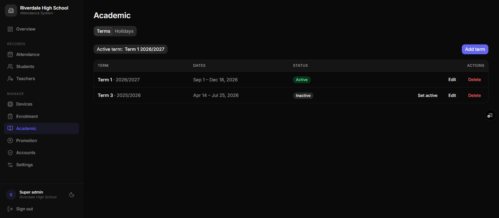

# School Manual
:kicker: Institution type guide
:subtitle: Running a school, college, or training centre on the attendance system
:audience: Heads, school administrators, and class teachers
:version: Version 3.0 | September 2026
:accent: #6d28d9
:series: school
:output: clients

<<<TOC>>>

## 1. What a school account looks like

>> A school account records **students** -- and, if you like, **teachers and staff** -- by fingerprint. It is the only type with academic terms and year-end promotion, and the register completes itself: nobody marks anyone absent by hand.

Your menu has:

- **Overview** -- present and absent today, the attendance rate, and the latest scans
- **Attendance** -- every scan record, with filters, totals, and export
- **Students** and **Teachers** -- your rosters (the default words are *Members* and *Staff*; see section 3)
- **Devices** and **Enrollment** -- the scanners and the fingerprints on them
- **Academic** -- terms and holidays
- **Promotion** -- moving everyone up at the end of the year
- **Accounts** and **Settings**

Which of these each person sees depends on their role -- see the role guides for super admins, admins, and staff.

### 1.1 How a school day is recorded

1. A student places a finger on their class's scanner. It recognises them and shows "PRESENT".
2. The dashboard shows the scan within seconds, filed under today and the active term.
3. Each evening, every active student who didn't scan gets an **Absent** record -- except on holidays and on weekdays you don't track.

> [!NOTE] Absences appear that evening, not during the day. If a scanner was offline, its saved scans upload when it reconnects and turn those absences back into present.

## 2. Setting up, in the right order

1. **Settings** -- name, logo, timezone, and **Days tracked** (leave Saturday and Sunday unselected unless you hold weekend classes). Rename the labels to your school's words (section 3).
2. **Academic** -- create the current term, press **Set active**, and add its holidays (section 4).
3. **Devices** -- give each scanner its group and class, e.g. *Form 2* and *Science*.
4. **Students** -- add them one by one or import each class from a spreadsheet (section 5).
5. **Enrollment** -- enrol each student's fingerprints, then activate them.
6. **Accounts** -- create logins for your admins and class teachers (section 6).

> [!WARNING] Create the term **before** the first scan. Every record is tied to the term active when the scan happened, and scans taken with no active term are hard to report on later.

> [!TIP] Name your scanners' groups so they sort in order -- *Form 1*, *Form 2*, *Form 3* or *JHS 1*, *JHS 2*, *JHS 3* -- and use the **same class names in every form**. Promotion depends on it (section 7).

## 3. Words you can change

The dashboard's default words are Member, Group, Unit, Period, and Staff. Most schools rename them under **Settings -> Custom labels**:

<!-- cols: 34 66 -->
| Default | A school usually says |
| --- | --- |
| Member / Members | Student / Students |
| Group | Form, Grade, or Year |
| Unit | Class, Stream, or Section |
| Period | Term or Semester |
| Staff | Teacher |

The new words appear everywhere -- menus, page titles, column headings, and CSV exports. Nothing about the data changes, so you can adjust them at any time.

## 4. Terms and holidays

### 4.1 Terms

1. Go to **Academic** and press **Add term**.
2. Enter the **Term** (e.g. *Term 1*), the **Year** (e.g. *2026* or *2025/2026*), and the start and end dates.
3. Save, then press **Set active** on its row.

**Keep exactly one term active.** It's what each scan is filed under and what reports default to. At the end of a term, create the next one and press **Set active** on it.

### 4.2 Holidays

On the **Holidays** tab, press **Add holiday** and add every non-teaching day: mid-term breaks, public holidays, and staff training days. Give a start date, and an end date for a break of several days. Nobody is marked absent on those dates.

Tick **Repeats every year** for holidays on a fixed date, such as Independence Day. Leave it unticked for dates that move, such as Easter, and add those each year.

> [!TIP] Enter next term's holidays when you create the term. A missed holiday produces a full register of false absences that someone then has to explain to parents.

## 5. Students

### 5.1 Adding one student

Go to **Students** and press **Add student**. Enter the full name and ID, and choose their class -- listed as form and class, e.g. *Form 2 Science*. After saving, the dashboard offers to enrol their fingerprints straight away.

### 5.2 Importing a whole class

1. Press **Import CSV** and download the template.
2. Fill in one row per student: `sid` (their ID), `fullname`, and the class as the dashboard shows it, e.g. *Form 2 Science*.
3. Upload it. A preview shows which rows are ready and which have a problem before anything is saved.
4. Confirm.

**Imported students start Inactive**, because they have no fingerprints yet. Enrol each one, then press **Activate** -- only active students are counted in attendance and absence marking.

### 5.3 Leavers

Press **Deactivate** on a student's row. Their history is kept and they stop being marked absent. Students are never deleted, so past registers stay complete.

## 6. Teachers and class scoping

Give each class teacher a **Teacher** account, assigned to their class under **Accounts**. They can then see and export their own class's register and roster -- and nothing else. They can't change anything.

If you track teachers' own attendance too, turn on **Track staff** in Settings. Teachers then appear on the **Teachers** page and scan like students.

For a head of year who should manage one class, create an **Admin** account assigned to that class. They can manage its records and enrol fingerprints on its scanner.

## 7. Year-end promotion

**Promotion** moves every active student up one form, in one step. Students in the final form are deactivated instead of promoted.

### 7.1 How the dashboard works out who goes where

The dashboard sorts your form names in natural order -- *Form 2* comes before *Form 10* -- and moves each student to the scanner with the **same class name** in the next form:

<!-- cols: 30 30 40 -->
| Now in | Moves to | Because |
| --- | --- | --- |
| Form 1 Science | Form 2 Science | Next form, same class name |
| Form 2 Arts | Form 3 Arts | Next form, same class name |
| Form 3 Science | *Deactivated* | Form 3 is the final form |
| Form 1 Business | *Skipped* | There is no *Form 2 Business* scanner |

Skipped students are listed in a warning on the Promotion page. Set up the missing scanner first and they'll be included.

### 7.2 Running it

1. Finish the year's reports, then **export the full year's attendance**.
2. Go to **Promotion** and review each card: how many students move from which form to which.
3. Resolve any skipped students.
4. Press **Apply promotion**, check the summary, and press **Confirm**.

> [!WARNING] Promotion is bulk and **irreversible**. It also clears promoted students' fingerprint links, so **every promoted student must be enrolled again** on their new class's scanner before they can scan.

### 7.3 After promotion

Last year's prints are still stored on the old scanners, so re-enrolling a student can fail with "OCCUPIED" when their new slot is already in use. Either press **+ overwrite** on the failed job, or start clean: run a **Clear all** job on each scanner, re-enrol its master finger, then enrol the new class. Plan this for the first days of term, before registers matter.

## 8. Reading attendance

- **Records** is the daily register: one row per student per day. With **Flag late arrivals** on in Settings, students who scan after your start time plus the grace period carry a **Late** badge.
- **Summary** gives present and absent totals and the attendance percentage for each class and term -- handy for termly reports.
- **By student** gives each student's totals, rate, and last scan -- the quickest way to spot persistent absence.

Use the **Term** and **Classes** filters, then **Export CSV** to take any view into a spreadsheet.

## 9. Everyday problems

<!-- cols: 36 64 -->
| Problem | What to do |
| --- | --- |
| A whole class is absent on one day | A holiday is missing, or the scanner was off all day. Add the holiday; check the scanner's screen. |
| A student was in school but shows absent | They didn't scan, or the scan failed -- "NO MATCH" on the screen means it didn't count. |
| The scanner says "NOT LOGGED" | The scan was accepted but not counted: a holiday, an untracked weekday, no active term, or already recorded today. |
| A new student can't scan | Their fingerprint isn't enrolled yet, or they're still Inactive. |
| Records aren't tied to a term | No term was active at the time. Create one and press **Set active**. |
| A teacher sees nothing | Their account has no class assigned, or the wrong one. |
| An import rejects rows | A field is missing, or a class doesn't match your scanners' names. |
| Students skipped at promotion | No scanner exists for their next form with the same class name. |

## 10. The scanner, at a glance

::: screens
PRESENT | Ama Mensah | **Recorded.** The light flashes green.
SAVED | Ama Mensah | Offline | **Saved offline**; uploads when the internet returns.
NOT LOGGED | Ama Mensah | **Not counted** -- holiday, untracked day, or duplicate.
COOLDOWN | Ama Mensah | **Scanned twice** in a minute. Normal.
NO MATCH | **Not recognised.** Try again, finger flat.
PENDING | 24:6F:28:A1:B2:C3 | **Not set up yet** -- see your super admin.
:::

| Light | Meaning |
| --- | --- |
| Solid blue | Ready and online |
| Solid purple | Ready, but no WiFi |
| Green flash | Scan accepted |
| Red flash | Not recognised |
| Solid yellow | Waiting for a finger during enrollment |
| Breathing yellow | Waiting to be set up |
| Breathing red | Installing an update -- do not unplug |

> [!TIP] A scanner that has lost WiFi keeps working. It stores scans and uploads them when the connection returns, so a router outage never costs you a day's register.
