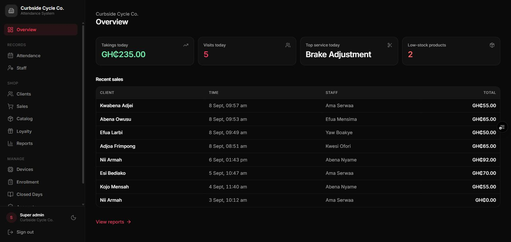
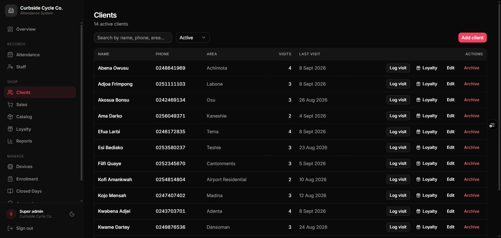
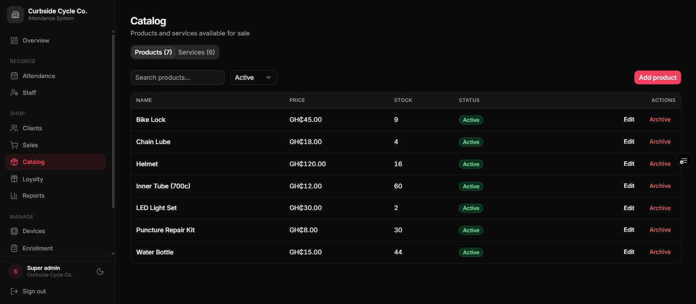
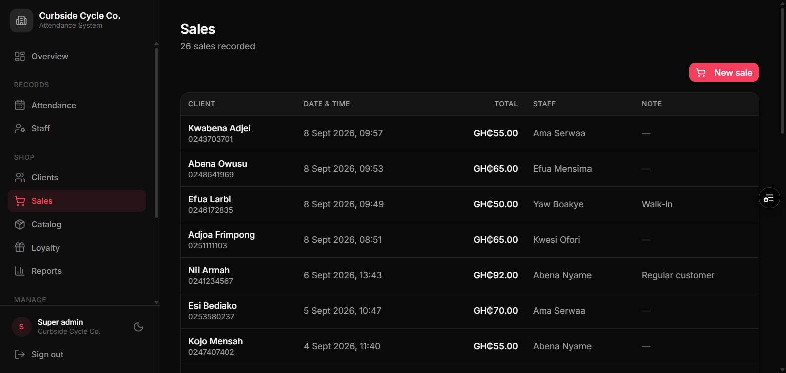
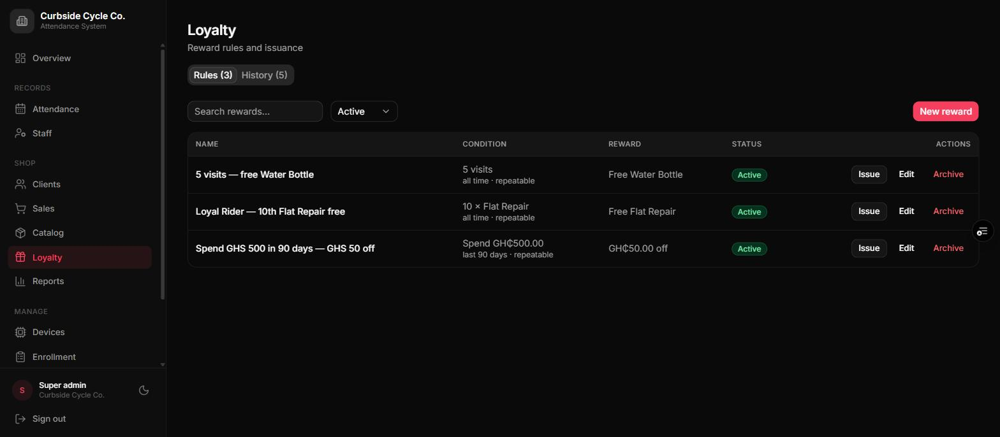
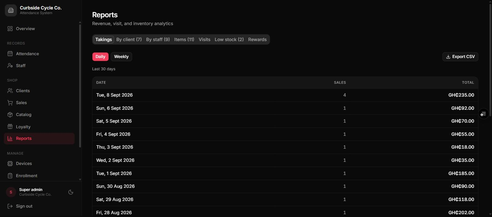

# Shop Manual
:kicker: Institution type guide
:subtitle: For shops, salons, barbershops, and other retail or service businesses
:audience: Shop owners, managers, and cashiers
:version: Version 3.0 | September 2026
:accent: #be185d
:series: shop
:output: clients
:toc_depth: 2

<<<TOC>>>

## 1. What the system does for a shop

>> A shop account does two separate jobs. They share one login and one dashboard, but neither depends on the other -- you can use either half on its own.

<!-- cols: 22 42 36 -->
| Half | What it covers | How records are made |
| --- | --- | --- |
| **Staff attendance** | Your own employees -- stylists, barbers, sales assistants, mechanics | A fingerprint scan at the scanner |
| **Retail** | Your customers, sales, stock, and loyalty rewards | Typed into the dashboard by a cashier or manager |

> [!NOTE] Customers never touch the fingerprint scanner -- only your employees are enrolled. A customer's visit is recorded when a sale is made for them, or when someone presses **Log visit** on their row.

### 1.1 What you'll find in the menu

- **Overview** -- takings and visits today, the top service, low-stock warnings, and the latest sales
- **Attendance** and **Staff** -- your employees' attendance and roster
- **Clients** -- your customer list
- **Sales** -- record and review sales
- **Catalog** -- the products and services you sell *(shown when you sell either)*
- **Loyalty** -- reward rules and the history of rewards given *(shown when loyalty is on)*
- **Reports** -- takings, best clients, revenue per staff member, best sellers, visits, stock, and rewards
- **Devices**, **Enrollment**, **Closed Days**, **Accounts**, **Settings** -- set-up and administration

Each role sees only what it's allowed to use -- section 10 has the full list.

## 2. Setting up, in the right order

1. **Settings** -- currency, timezone, shop name and logo, and which modules you use: products, services, loyalty (section 3).
2. **Closed Days** -- your public holidays and any dates you'll be shut.
3. **Catalog** -- the services and products you sell, with prices.
4. **Staff** -- your employees.
5. **Enrollment** -- each employee's fingerprints, at the scanner.
6. **Accounts** -- logins for your manager and cashiers.
7. **Clients** -- add customers as they come in; there's no need to load them in advance.
8. **Loyalty** -- once the catalog is in, your reward rules.

> [!TIP] Do steps 1--3 before you record a single sale. Each sale keeps the prices and currency of the moment it was recorded, so getting them right first saves you correcting history later.

## 3. Settings that matter for a shop

Found under **Settings**. Only a super admin can change them.

<!-- cols: 28 72 -->
| Setting | What it does |
| --- | --- |
| **Currency** | The currency every amount is shown in -- GHS, NGN, and others. Display only: it doesn't convert existing figures, so choose it once and leave it. |
| **Sell products** | Off hides the Products tab and product lines on sales. Turn it off if you only sell services. |
| **Sell services** | Off hides the Services tab and service lines. Turn it off if you only sell products. |
| **Enable loyalty rewards** | Off hides the Loyalty page and reward suggestions. History is kept and returns if you switch it back on. |
| **Timezone** | When "today" starts and ends for visits, takings, and staff absences. |
| **Days tracked** | The weekdays staff attendance counts. Most shops trade at weekends, so leave Saturday (and Sunday) selected. For one-off dates you're shut, use **Closed Days**. |
| **Track staff** | Must be on for employee attendance. |

> [!NOTE] Turning off **Sell products** or **Sell services** only hides them from new sales. Past sales keep their items and prices and still appear correctly in Reports.

## 4. Clients

**Clients** are your customers -- a separate list from **Staff**. A client has no fingerprint.

### 4.1 Adding a client

1. Go to **Clients** and press **Add client**.
2. Enter the **Name** and **Phone number**, and optionally their area.
3. Save.

**The phone number is required and unique** -- it's what ties a customer to their visits and loyalty progress. Type it as `0XXXXXXXXX` or `+233XXXXXXXXX`; the dashboard stores both the same way, so the same number can't be entered twice.

### 4.2 Working with a client

<!-- cols: 26 74 -->
| Action | What it does |
| --- | --- |
| **Log visit** | Records that they came in today and opens a new sale for them. If today's visit is already logged, it says so. |
| **Loyalty progress** (gift icon) | How close they are to each reward, and anything they've already earned. |
| **Visit history** | Every day they've been in. |
| **Edit** | Change the name, phone, or area. |
| **Archive** | Hides them from the active list, keeping all their history. Admins only. |

A client counts **one visit per day**, however many sales they make that day -- which keeps visit-based rewards fair. Use the status filter to see archived clients.

## 5. Catalog -- products and services

**Catalog** holds everything you can put on a sale, in two tabs.

<!-- cols: 24 38 38 -->
| | **Products** | **Services** |
| --- | --- | --- |
| Examples | Shampoo, clippers, inner tubes | Haircut, retwist, puncture repair |
| Has a price | Yes | Yes |
| Has stock | Yes -- counts down with each sale | No |

### 5.1 Adding and changing items

Press **Add product** or **Add service**, enter the name and price (and, for a product, the stock you hold now), and save. Two active items on the same tab can't share a name; archiving an item frees its name.

To change a price, edit the item. **The new price applies to future sales only** -- every past sale keeps the price it was recorded at, so your takings never shift under you.

Press **Archive** to take an item off sale. It stays attached to every past sale that used it. Items are never deleted.

### 5.2 Stock

Product stock counts down automatically with each sale. It may go below zero -- the dashboard won't block a sale because the count says none are left, since the count may simply be out of date. Correct it by editing the product and entering the real figure. **Reports -> Low stock** lists every product with 5 or fewer left.

Cashiers can see the catalog but not change it.

## 6. Recording a sale

This is the main daily task. Go to **Sales** and press **New sale** (or press **Log visit** on a client's row).

1. **Client** -- required. Start typing to find them; add them on the Clients page first if they're new.
2. **Rewards** -- if the client has earned anything, it appears here by itself (section 7.3).
3. **Staff** -- optional: who served them. Fill it in if you want **Reports -> By staff** to be meaningful.
4. **Items** -- one line per product or service, with the quantity.
5. **Price** -- to give a discount by hand, change the price on that line.
6. **Note** -- optional, e.g. *Client paid in cash*.
7. Press **Record sale**.

Recording a sale does three things at once: it saves the sale, counts today as a visit for that client, and reduces stock for any products sold.

> [!NOTE] Each line keeps the item's name and price **as they were at that moment**. Renaming or repricing a catalog item later never changes a recorded sale.

## 7. Loyalty rewards

**Loyalty** is a punch-card system. You set a target, the dashboard counts towards it from real sales and visits, and a reward appears at the till the moment a client qualifies -- nobody has to remember or check.

### 7.1 Building a rule

Press **New reward** and fill in three parts.

**Name** -- write it the way you'd say it, e.g. *Free wash every 10 retwists*.

**Condition -- when is it earned?**

<!-- cols: 32 68 -->
| Count | Meaning |
| --- | --- |
| **Number of services** | Service lines sold -- optionally one particular service. |
| **Number of products** | Product lines sold -- optionally one particular product. |
| **Number of visits** | Days the client came in. |
| **Total amount spent** | Money spent, in your currency. |

Then set the target number and the **Counting window**:

- **Since last reward issued (punch-card)** -- the usual choice. The count starts again each time they earn it.
- **All time** -- counts their whole history.
- **Rolling window (days)** -- counts only the last so many days.

Leave **Repeatable (resets and can be earned again)** ticked so regulars can earn it again and again.

**Reward -- what do they get?** A **Free service**, a **Free product**, a **Discount** of a fixed amount, or **Custom** -- any reward described in words.

### 7.2 Where a reward shows up

- **In the Sales screen, the moment you pick the client** -- this is where the free item or discount is actually used.
- **On the Clients page** -- **Loyalty progress** shows how close a client is to every rule, and lets you issue anything already earned even if they aren't buying today.

### 7.3 Applying a reward at the till

Pick the client in **New sale**. If they've earned something, the **Rewards** panel lists it with an **Apply** button.

<!-- cols: 26 74 -->
| Reward | What Apply does |
| --- | --- |
| **Free service** or **Free product** | Makes the matching line free, or adds a free line if it isn't in the sale yet. That line locks, so its price can't be changed by accident. |
| **Discount** | Takes the amount off the total. You'll see the subtotal and the reward shown separately above the total. |
| **Custom** | Puts the reward's description in the note. Give it to the client yourself. |

Nothing is final until you press **Record sale** -- press **Undo** on the reward if you picked the wrong one. Once recorded, the reward is used and won't appear again until they earn it again. A reward earned on an earlier visit and never used shows as *already earned* next time, so nothing is lost.

### 7.4 Who can apply and issue rewards

Cashiers can apply rewards at the till and issue them from a client's loyalty progress, just like admins. The dashboard checks every time that the client has genuinely earned the reward, whoever presses the button -- so there's no need to route it through a manager. Building and editing rules is for admins.

> [!TIP] Check **Loyalty progress** while the client is still at the counter. It's the moment to tell them they're two visits away from a free treatment.

## 8. Reports

**Reports** is for admins and super admins. Each tab answers one question:

<!-- cols: 22 78 -->
| Tab | Answers |
| --- | --- |
| **Takings** | What did we make, day by day and week by week? |
| **By client** | Who spends the most with us? |
| **By staff** | How much did each staff member bring in? |
| **Items** | What sells best? |
| **Visits** | How often do clients come back? |
| **Low stock** | What do I need to reorder? (5 or fewer left) |
| **Rewards** | Which rewards have been given and redeemed, and how many are outstanding? |

Takings, By client, and By staff can be exported to CSV. **By staff** only counts sales where someone filled in the staff field -- make that a habit at the till.

## 9. Employee attendance

Your employees are on the **Staff** page and scan the fingerprint scanner as in any other institution:

1. Add the employee under **Staff**.
2. Enrol their fingerprints -- straight after adding them, or from **Enrollment**.
3. Press **Activate** on their row.
4. From then on they scan when they arrive (and when they leave, in Time In / Time Out mode).

**Closed Days** records the dates the shop is shut, so staff aren't marked absent. Add public holidays there and tick **Repeats every year** for fixed dates. For a day you close every week, unselect it under **Days tracked** in Settings instead.

### 9.1 Staff who are also cashiers

If someone clocks in with a fingerprint *and* signs in to record sales, link their cashier login to their staff record when the account is created (the **Linked staff** field). That keeps one person from appearing as two unrelated entries.

## 10. Who can do what

<!-- cols: 46 18 18 18 -->
| | Super admin | Admin | Cashier |
| --- | --- | --- | --- |
| Record a sale, apply a reward | Yes | Yes | Yes |
| Add and edit clients, log visits | Yes | Yes | Yes |
| Archive a client | Yes | Yes | No |
| See the catalog | Yes | Yes | Yes |
| Add, edit, or archive catalog items | Yes | Yes | No |
| Issue a reward a client has earned | Yes | Yes | Yes |
| Build or edit loyalty rules | Yes | Yes | No |
| Reports | Yes | Yes | No |
| Staff roster, attendance, closed days | Yes | Yes | No |
| Scanners and fingerprint enrollment | Yes | No | No |
| Accounts | Yes | View only | No |
| Settings | Yes | No | No |

**Cashier** is the till role: clients, sales, and the catalog, and nothing else. Give it to counter staff -- it keeps takings, staff records, and settings out of reach without getting in the way of serving customers.

## 11. The scanner, at a glance

::: screens
TIME IN | Kwame Boateng | **Arrival recorded.** "TIME OUT" when they leave.
SAVED | Kwame Boateng | Offline | **Saved offline**; uploads when the internet returns.
NOT LOGGED | Kwame Boateng | **Not counted** -- closed day, untracked day, or duplicate.
COOLDOWN | Kwame Boateng | **Scanned twice** in a minute. Normal.
NO MATCH | **Not recognised.** Try again, finger flat.
PENDING | 24:6F:28:A1:B2:C3 | **Not set up yet** -- see the Super Administrator Manual.
:::

| Light | Meaning |
| --- | --- |
| Solid blue | Ready and online |
| Solid purple | Ready, but no WiFi |
| Green flash | Scan accepted |
| Red flash | Not recognised |
| Breathing yellow | Waiting to be set up |
| Breathing red | Installing an update -- do not unplug |

## 12. Everyday problems

<!-- cols: 38 62 -->
| Problem | What to do |
| --- | --- |
| "Invalid phone number" | Type it as `0XXXXXXXXX` or `+233XXXXXXXXX`. |
| A phone number is rejected as taken | It belongs to another client -- possibly an archived one. Search for it. |
| A product or service name is rejected | An active item already uses it. Rename it, or find and reuse the existing one. |
| A sale went in wrong | Record a correcting sale and explain it in the note. Ask your super admin if a record must be removed. |
| The stock count is wrong | Edit the product and enter the real figure. |
| A staff member is absent on a day you were shut | Add that date under **Closed Days**. |
| **By staff** looks empty | The staff field was left blank on those sales. |
| The scanner shows a "queued" count | It has lost WiFi. Scans are safe and upload by themselves; check the router. |
