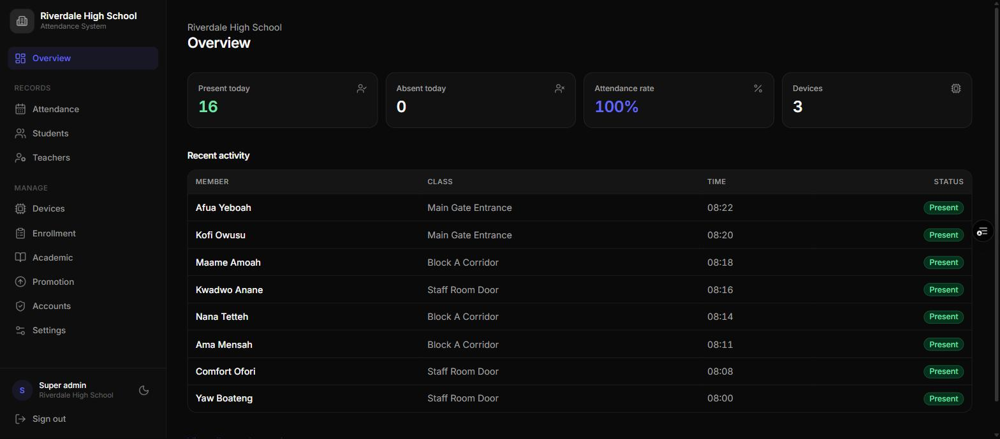
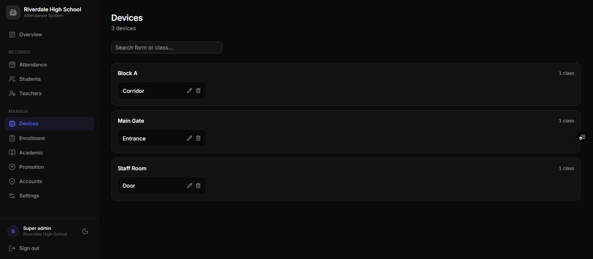
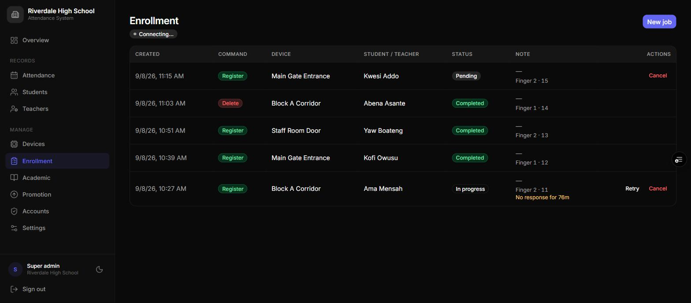
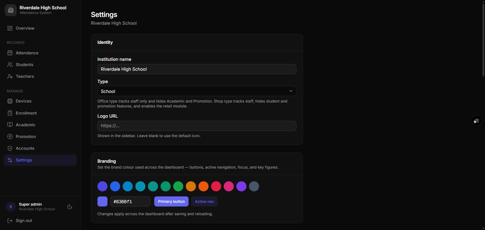

# Super Administrator Manual
:kicker: Role guide
:subtitle: Scanners, enrollment, settings, and accounts -- full control of your institution
:audience: Super administrators -- the owner account of an institution
:version: Version 3.0 | September 2026
:accent: #4338ca
:series: super_admin
:output: clients
:toc_depth: 2

<<<TOC>>>

<<<PAGEBREAK>>>

## 1. At a glance

>> As super admin you own your institution's set-up: its scanners, its fingerprints, its settings, and who can sign in. Everything an admin can do, you can do too.

::: can
- Set up, rename, and delete scanners
- Enrol and delete fingerprints, including master fingers
- Add, import, edit, and deactivate people
- Manage periods, holidays, and tracked weekdays
- View and export all attendance
- Change settings, labels, branding, and modules
- Create, edit, and delete accounts -- including other super admins
:::
::: cannot Only your platform administrator can
- Add a brand-new scanner to your institution
- Reflash a scanner, or update its firmware
- Block a lost or stolen scanner instantly
- Restore access if every super admin is locked out
- Create or remove whole institutions
:::

> [!TIP] This guide covers what your **role** can do. Read it alongside the guide for your kind of organisation -- the School, Office, or Shop manual.

### 1.1 Words used in this guide

You can rename most of these under **Settings -> Custom labels** (section 10). This guide uses the defaults.

<!-- cols: 20 50 30 -->
| Word | Meaning | A school might say |
| --- | --- | --- |
| **Member** | A person whose attendance is recorded | Student |
| **Staff** | People on the second roster, if you keep one | Teacher |
| **Group** | A set of units | Form, Grade, or Year |
| **Unit** | One place people scan -- one scanner per unit | Class |
| **Period** | A stretch of time you report on | Term |
| **Enrollment** | Saving someone's fingerprint on a scanner | -- |
| **Master finger** | An admin's finger that reopens a scanner's WiFi setup | -- |

## 2. Signing in and finding your way

Open the dashboard address, enter your email and password, and press **Sign in**. There is no self-service password reset: another super admin can reset yours from **Accounts**, or your platform administrator can if you're the only one.

The menu groups pages under **Records**, **Shop** (shops only), and **Manage**:

<!-- cols: 30 70 -->
| Page | What it's for |
| --- | --- |
| **Overview** | Today's present and absent counts, attendance rate, and the latest scans. Shops see takings, visits, and stock warnings. |
| **Attendance** | Every attendance record, with filters, totals, and CSV export. |
| **Members** and **Staff** | Your rosters. |
| **Clients**, **Sales**, **Catalog**, **Loyalty**, **Reports** | The retail module -- shops only. |
| **Devices** | Your scanners. |
| **Enrollment** | Fingerprint jobs sent to scanners. |
| **Academic** | Periods and holidays. Called **Periods & Holidays** in an office and **Closed Days** in a shop. |
| **Promotion** | Year-end promotion -- schools only. |
| **Accounts** | Who can sign in, and with which role. |
| **Settings** | Names, labels, branding, attendance rules, and modules. |

On a phone, the menu becomes a bottom bar with **More** for everything else. **Install app** in the menu adds the dashboard to a home screen (on an iPhone: Safari's Share icon, then **Add to Home Screen**). For security, the dashboard signs you out after **10 minutes** without activity and when the browser closes.

## 3. First-time set-up, in order

Work through these once. Later steps depend on earlier ones.

1. **Settings** -- name, logo, timezone, labels, what you track, and the days you track (section 10).
2. **Periods and holidays** -- create the current period, press **Set active**, and add its holidays (section 7).
3. **Scanners** -- give each new scanner its group and unit (section 4.1).
4. **WiFi** -- connect each scanner to your network on site (section 4.4).
5. **Master finger** -- enrol one on every scanner before anything else goes wrong (section 4.5).
6. **People** -- add them one by one or import a spreadsheet (section 5).
7. **Fingerprints** -- enrol everyone, then activate them (section 6).
8. **Accounts** -- create logins for your admins, teachers or supervisors, and cashiers (section 11).

## 4. Scanners

### 4.1 How a new scanner joins

A new scanner can't join your institution by itself -- your platform administrator attaches it first. The whole journey looks like this:

1. The scanner is powered on for the first time. Its screen shows "PENDING" with its hardware address, and the light breathes yellow.
2. Your platform administrator assigns it to your institution. The light turns solid blue.
3. It appears on your **Devices** page under **Pending setup**, marked *Not configured*.
4. Press **Configure** and enter its **Group** and **Unit** -- e.g. *Form 2* and *Science*. The preview shows how it will be named.
5. Press **Save changes**. The scanner shows its new name on screen within a minute, and you can now add people to that unit.

> [!TIP] Name groups so they sort in order -- *Form 1*, *Form 2*, *Form 3* -- and reuse the same unit names in every group, e.g. *Science* and *Arts*. Year-end promotion relies on both (section 9).

### 4.2 Renaming a scanner

Press the pencil icon on its tile, change the group or unit, and press **Save changes**. The name on the scanner's screen follows automatically.

### 4.3 Deleting a scanner

Press the bin icon on its tile and confirm with **Delete device**.

> [!WARNING] Everyone assigned to that scanner loses their unit and can't scan until you give them a new one. The physical scanner wipes its identity on its next connection and starts again as a new, unassigned device. Attendance history is kept. Only delete a scanner you are retiring or rebuilding.

### 4.4 First-time WiFi setup

A factory-fresh scanner has no WiFi saved, so it opens its own setup network the first time it boots.

1. Power on the scanner. The screen shows "SETUP" and the light blinks purple.
2. On a phone or laptop, join the WiFi network **Attendance-Setup** with the password **setup1234**.
3. If a setup page doesn't open by itself, browse to `http://192.168.4.1`.
4. Enter your WiFi name and password and press **Save & Connect**. The scanner saves them and restarts.
5. Reconnect your phone to your normal WiFi.

The setup network only opens by itself on that very first boot. After that, only a master finger can reopen it. Keep the setup password within your admin team.

### 4.5 Enrolling a master finger -- do this on day one

A master finger is an admin's finger that reopens WiFi setup later -- when you move a scanner or change your WiFi password. It never records attendance.

1. Go to **Enrollment** and press **New job**.
2. Choose the command **Reg. master**.
3. Choose the scanner, and type a **Name** for whose finger it is, e.g. *Principal*.
4. Queue the job. At the scanner, press the finger when asked, lift it, and press it again.

> [!WARNING] Enrol a master finger on **every** scanner while it still has a working connection. Without one, a WiFi change means the scanner has to go back to your platform administrator to be reflashed.

### 4.6 Changing the WiFi later

1. At the scanner, scan the master finger. The screen shows "CONFIRM?".
2. Scan the same finger again within 8 seconds. The screen shows "CONFIRMED" and the light flashes yellow five times. A different finger, or waiting too long, cancels safely.
3. The **Attendance-Setup** network opens. Follow steps 2--5 of section 4.4.

### 4.7 What the screen tells you

When nobody is scanning, the screen shows the clock, the scanner's name, and its connection. The third line matters most when something is wrong:

::: screens
08:14 | Form 2 Science | Online | **Online.** Everything is working.
08:14 | Form 2 Science | No server | **No server.** WiFi works but the server can't be reached; scans are saved.
08:14 | Form 2 Science | Offline | 3 queued | **Offline.** Three scans are saved and will upload.
PENDING | 24:6F:28:A1:B2:C3 | **Not yet assigned.** Contact your platform administrator.
SETUP | Attendance-Setup | 192.168.4.1 | **WiFi setup is open** (section 4.4).
OTA UPDATE | Do not unplug | **Updating.** Leave it on; it restarts by itself in 1--3 minutes.
:::

After a scan:

<!-- cols: 34 66 -->
| Screen shows | What it means |
| --- | --- |
| "SCANNED" and a name | Recognised; checking with the server. Resolves within a second or two. |
| "PRESENT", "TIME IN", or "TIME OUT" | Recorded. |
| "SAVED", a name, and "Offline" | Recognised with no internet. Stored and uploaded automatically later. |
| "NOT LOGGED" | The server accepted the scan but didn't count it -- a holiday, an untracked weekday, no active period, or already recorded today. |
| "COOLDOWN" and a name | Same person scanned again within a minute. Normal. |
| "NO MATCH" | Fingerprint not recognised. Try again; if it keeps happening, re-enrol that finger. |
| "NOT MAPPED" and "See admin" | The finger is stored on the sensor but no person is linked to it on this scanner -- usually after promotion or a deleted person. Re-enrol or delete that slot. |
| "SCAN ERROR" | The scan couldn't be processed. Try again. |
| "REJECTED" or "REVOKED" | The server refuses this scanner. Contact your platform administrator. |
| "RESET" and "Re-provisioning" | The scanner was deleted and is wiping itself to start again. |

### 4.8 What the light tells you

| Light | Meaning |
| --- | --- |
| Solid blue | Ready and online. Normal. |
| Solid purple | Ready, but no WiFi. Scans are saved for later. |
| Blinking purple | WiFi setup is open. |
| Green flash | Scan accepted, or a task succeeded. |
| Red flash | Not recognised, or a task failed. |
| Solid yellow | Waiting for a finger -- during enrollment, or for the second master scan. |
| Five quick yellow flashes | Master finger confirmed; WiFi setup is opening. |
| Breathing yellow | Waiting to be assigned by your platform administrator. |
| Breathing red | Installing a firmware update -- do not unplug. |

## 5. Members and staff

### 5.1 Adding one person

1. Go to **Members** (or **Staff**) and press **Add member**.
2. Enter their **Full name**, their **ID**, and choose their **Unit**.
3. Press **Add member**. The next screen offers **Enroll fingerprints now?** -- queue Finger 1 and Finger 2 from there, or press **Done** and do it later.

### 5.2 Importing a spreadsheet

Press **Import CSV** and download the template. Fill in one row per person with the columns `sid` (ID), `fullname`, and the unit -- written as the dashboard shows it, e.g. *Form 2 Science*. Upload it: a preview flags any row with a missing field or a unit it can't match before anything is saved.

> [!NOTE] **Imported people start Inactive**, because they have no fingerprints yet. Enrol each person, then press **Activate**. Only active people count towards attendance and absence marking.

### 5.3 Editing, fingerprints, and leavers

Press the edit icon to change a person's name, ID, or unit. The **Fingerprints** panel lists their stored fingers by sensor slot: **Delete** removes one from the scanner; an empty finger can be enrolled from there.

To retire someone, press **Deactivate**. They stop being marked absent and their history is kept. People are never deleted from the dashboard.

## 6. Fingerprint enrollment

Enrollment is remote: you queue a job on the dashboard, and the scanner picks it up within about ten seconds and walks the person through it.

### 6.1 Queuing a job

Press **New job** and fill in:

<!-- cols: 28 72 -->
| Field | What to enter |
| --- | --- |
| **Command** | What the scanner should do -- see the table below. |
| **Device** | The scanner the person will use -- their unit's scanner. |
| **Member** | Who is enrolling. For a master finger you type a **Name** instead. |
| **Finger slot** | **Finger 1** or **Finger 2**. Enrol two fingers so a cut or plaster doesn't lock someone out. |
| **Sensor slot (1--127)** | Where the print is stored on the sensor. Filled in with the next free slot -- leave it. |
| **Allow overwriting an occupied slot** | Only tick this when you are deliberately replacing a stored print. You'll be asked to confirm. |

<!-- cols: 22 78 -->
| Command | What it does |
| --- | --- |
| **Register** | Saves a new fingerprint for a person. |
| **Delete** | Removes one stored fingerprint from the scanner. |
| **Reg. master** | Saves a master finger (section 4.5). |
| **Del. master** | Removes the master finger. |
| **Clear all** | Erases **every** fingerprint on that scanner, including the master. |

### 6.2 At the scanner

The person must be at the scanner while the job runs. The screen guides them:

::: screens 4
PRESS 1/2 | Kofi Owusu | **Press** the finger flat.
REMOVE | Kofi Owusu | **Lift** the finger.
PRESS 2/2 | Kofi Owusu | **Press** the same finger again.
ENROLLED | Kofi Owusu | **Done.** The light flashes green.
:::

If it goes wrong, the screen says why: "MISMATCH" (the two presses weren't the same finger), "TIMED OUT" (nobody pressed in time), "BAD SCAN" (a poor image), or "OCCUPIED" (the slot already holds a print and overwriting wasn't allowed).

### 6.3 Job status and fixing problems

<!-- cols: 22 78 -->
| Status | Meaning |
| --- | --- |
| **Pending** | Waiting for the scanner to collect it. |
| **In progress** | The scanner has it; the person should be scanning. |
| **Completed** | The fingerprint is saved. |
| **Failed** | It didn't work. The **Note** column says why. |

<!-- cols: 36 64 -->
| You see | Do this |
| --- | --- |
| "No response for 12m" under a job | The scanner lost the job or its connection. Press **Retry** to send it again, or **Cancel**. |
| **Pending** for a long time | The scanner is off or offline. Check its screen; **Cancel** if you queued it by mistake. |
| **Failed** | Press **Re-queue** to try again once the person is back at the scanner. |
| **Failed** with an occupied slot | Press **+ overwrite** to retry and replace what's in that slot -- only if that print no longer belongs to anyone. |

The badge beside the page title shows whether the page is receiving live updates.

## 7. Periods, holidays, and tracked days

- **Periods:** press **Add term**, enter the name, year, and dates, save, then press **Set active** on its row. Keep exactly one active -- each scan is filed under the active period.
- **Holidays:** on the **Holidays** tab press **Add holiday**, enter a label and dates, and tick **Repeats every year** for fixed dates. Nobody is marked absent on a holiday.
- **Tracked days:** under **Settings -> Days tracked**, select the weekdays that count. Scans on other days are ignored and no absences are added, so a Monday-to-Friday institution simply leaves Saturday and Sunday unselected.

## 8. Attendance

**Attendance** has three tabs -- **Records**, **Summary** (totals per unit and period), and **By member** (each person's totals and last scan) -- and filters for dates, period, member type, status, people, and units. With punctuality flags on, late arrivals carry a **Late** badge and early departures an **Early** badge. **Export CSV** downloads exactly what the filters show.

> [!NOTE] Each evening the system adds an **Absent** record for every active person who didn't scan, skipping holidays and untracked days. Scans saved by an offline scanner upload later and correct those records.

## 9. Year-end promotion (schools)

**Promotion** moves every active student to the next group -- students in the last group are deactivated instead. The dashboard works out the order by sorting your group names (*Form 1* before *Form 2* before *Form 10*), and moves each student to the scanner with the **same unit name** in the next group. A student whose next group has no matching unit is skipped and listed as a warning.

1. Go to **Promotion** and review the preview and any warnings.
2. Add any missing scanners first, so nobody is skipped.
3. Export the year's attendance.
4. Press **Apply promotion**, then **Confirm**.

> [!WARNING] Promotion can't be undone, and it clears promoted students' fingerprint links -- **every promoted student must be enrolled again** on their new scanner. Their old prints stay on last year's scanners, so a new enrollment may fail as "OCCUPIED": use **+ overwrite** on that job, or run **Clear all** on each scanner first and then re-enrol everyone, including the master finger.

## 10. Settings

<!-- cols: 30 70 -->
| Setting | What it controls |
| --- | --- |
| **Institution name** | Shown at the top of the menu. |
| **Type** | School, Office, or Shop -- decides which pages and modules exist. Talk to your platform administrator before changing it on a live institution. |
| **Logo URL** | A web link to your logo image, shown in the menu. Leave blank for the default icon. |
| **Branding** | Pick a preset colour or enter your own. Colours buttons, active menu items, and key figures after you save and reload. |
| **Custom labels** | Your own words for Member, Group, Unit, Period, and Staff -- used everywhere, including CSV headings. |
| **Track students** / **Track staff** | Which rosters exist, each with a **Scan mode**: *Present / Absent* (one scan a day) or *Time In / Time Out* (first scan in, second out). |
| **Days tracked** | The weekdays that count. Untracked days record nothing and generate no absences. |
| **Flag late arrivals** | Set an **Expected start time** and a **Grace period**. Arrivals after start plus grace are marked **Late**. |
| **Flag early departures** | Set an **Expected end time** and a **Grace period**. Time-out scans before end minus grace are marked **Early**. Time In / Time Out mode only. |
| **Timezone** | When your day starts and ends -- e.g. *Africa/Accra*. |
| **Time display** | 24-hour (13:30) or 12-hour (1:30 PM) on the dashboard. Exports always stay 24-hour. |
| **Name shown on device screen during a scan** | Full name, first name, initial + last name, ID number only, or no name. Enrollment always shows the full name. |
| **Currency**, **Sell services**, **Sell products**, **Enable loyalty rewards** | The retail module -- shops only. See the Shop Manual. |

> [!TIP] "Name shown on device screen" is a privacy control. Where a queue can read the screen, *first name* or *initial + last name* avoids showing everyone's full name.

## 11. Accounts

### 11.1 Creating an account

1. Go to **Accounts** and press **Add account**.
2. Enter their **Email** and an initial **Password** of at least 8 characters.
3. Choose a **Role** (see below).
4. For a teacher or staff account, choose their **Assigned unit** -- it limits everything they see. For an admin it's optional: leave it blank for the whole institution, or pick a unit to limit them to it.
5. For a cashier, you can link the login to their **Staff** record, so the person who clocks in and the person at the till are the same entry.
6. Press **Add account** and give them the address and password.

### 11.2 Roles

<!-- cols: 22 78 -->
| Role | What they can do |
| --- | --- |
| **Super Admin** | Everything in this guide. |
| **Admin** | People, periods, holidays, attendance, promotion, and the shop module. Sees Accounts but can only change their own password. Tied to a unit, they can also enrol fingerprints on its scanner. |
| **Teacher** or **Staff** | Read-only attendance and roster for their assigned unit. Schools call the role *Teacher*; offices and shops *Staff*. |
| **Cashier** | Shops only: clients, sales, and viewing the catalog. No reports, staff, or settings. |

### 11.3 Managing accounts

- **Edit** (pencil) changes someone's role, assigned unit, or linked staff record. Email addresses can't be changed -- create a new account instead.
- **Change password** (key icon) works on your own account and on any admin, teacher, staff, or cashier account. Another super admin changes their own.
- **Delete** (bin icon) removes the account and its access immediately.

You can't delete your own account, and the dashboard won't delete or demote your institution's last super admin.

## 12. Getting help

Everything in this guide you can do yourself. Contact your platform administrator for:

- A new scanner that needs attaching to your institution
- A scanner showing "REJECTED" or "REVOKED", or one that never leaves "PENDING"
- A scanner that needs reflashing -- for example, WiFi changed and no master finger was enrolled
- A lost or stolen scanner that must be blocked straight away
- Access for your only super admin account
